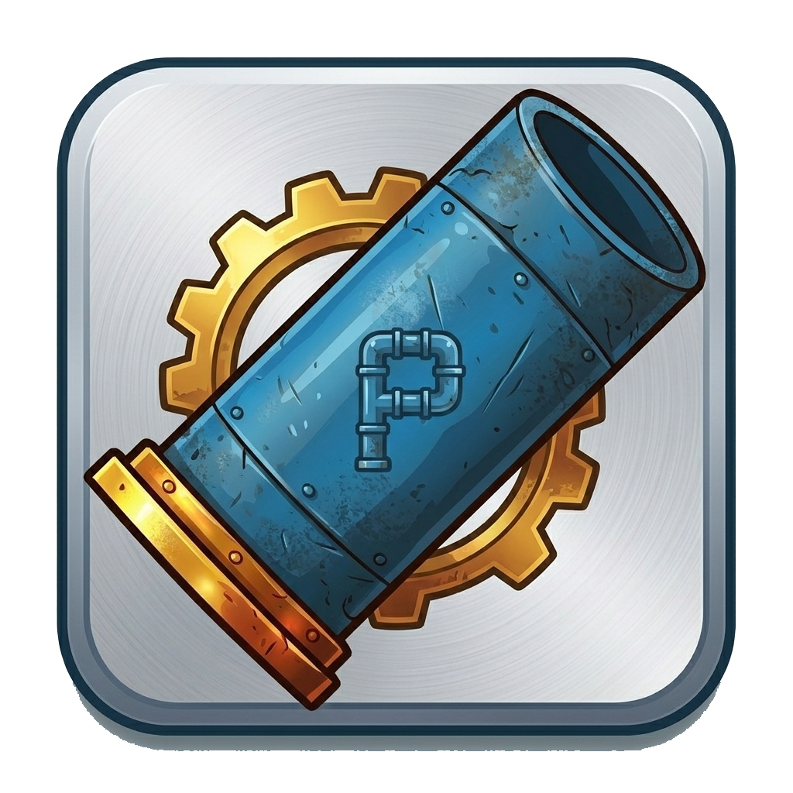

<div align="center">



# FloodRush

**A fast-paced pipe-routing puzzle game where you race the flood.**

[](https://github.com/nikneem/floodrush/actions/workflows/pr-validation.yml)
[](https://dotnet.microsoft.com/download/dotnet/10.0)
[](http://unlicense.org/)
[](https://dotnet.microsoft.com/apps/maui)

</div>

---

## What is FloodRush?

FloodRush is a **landscape-only .NET MAUI puzzle game** built on **.NET 10**. Each level presents a grid with
predefined start and finish points. Your job is to lay pipe sections and build a valid route before the fluid
reaches an unconnected end. Once the flow starts it never stops — plan ahead, or get flooded.

The game is backed by an **ASP.NET Core modular-monolith server** that manages player profiles,
distributes levels, accepts score submissions, and synchronises offline progress whenever a connection
becomes available.

---

## Features at a glance

| | |
|---|---|
| 🌊 **Race the flood** | Fluid advances on a configurable timer. Build fast or lose. |
| 🧩 **Seven pipe types** | Straight, corner, and cross sections each carry their own score. |
| ⚗️ **Fixed special tiles** | Fluid basins and split sections add routing depth. |
| 📴 **Offline-first** | Gameplay, cached levels, and settings all work without a connection. |
| 🔄 **Cloud sync** | Progress, scores, and settings synchronise automatically when online. |
| 📊 **Leaderboards** | Compare scores globally per level. |
| 📱 **Landscape lock** | Designed for landscape-only play on phone and tablet. |
| 🔭 **Built-in observability** | OpenTelemetry traces and structured logs flow into the Aspire dashboard. |

---

## Gameplay

### Core concepts

| Term | Description |
|---|---|
| **Start point** | Where fluid begins flowing after the pre-flow countdown. |
| **Finish point** | Required destination(s) — a level is won only when all are reached. |
| **Flow speed indicator** | An integer from 1 to 100 that drives simulation timing. |
| **Fluid basin** | A fixed tile that fills before downstream flow continues; awards bonus points. |
| **Split section** | A fixed tile that branches flow into two simultaneous paths; can require multiple finish points and applies a downstream speed modifier. |
| **Cross section** | Can be traversed twice — once per axis. The second perpendicular traversal awards a large bonus. |

### Pipe types and scoring

| Pipe type | Points |
|---|---:|
| Horizontal | 10 |
| Vertical | 10 |
| Corner (any orientation) | 12 |
| Cross — first traversal | 10 |
| Cross — second traversal (bonus) | 50 |

### Game phases

```
LevelLoaded → PlacementOpen → FlowActive → Succeeded / Failed → ScoreFinalized
```

During **PlacementOpen** you draw from a fixed ten-item pipe stack and place sections on the grid.
Once the countdown expires the game enters **FlowActive** — pipes lock, fluid advances, and every
tile the fluid enters scores points. Hit all finish points to win; let the fluid reach an open end and
the run fails.

---

## Solution structure

```
floodrush/
├── src/
│   ├── Game/
│   │   ├── HexMaster.FloodRush.Game           # .NET MAUI client (Android · iOS · macOS · Windows)
│   │   └── HexMaster.FloodRush.Game.Core      # Platform-agnostic engine, rules, scoring
│   ├── Server/
│   │   ├── HexMaster.FloodRush.Api            # ASP.NET Core host (OpenAPI via Scalar)
│   │   ├── HexMaster.FloodRush.Server.Abstractions  # CQRS interfaces, shared server helpers
│   │   ├── HexMaster.FloodRush.Server.Profiles      # Device auth, JWT, player profile CRUD
│   │   ├── HexMaster.FloodRush.Server.Levels        # Level catalog, release gating, download
│   │   └── HexMaster.FloodRush.Server.Scores        # Score submission and leaderboards
│   ├── Shared/
│   │   └── HexMaster.FloodRush.Shared.Contracts  # Client ↔ server DTOs
│   ├── Aspire/
│   │   └── HexMaster.FloodRush.Aspire/
│   │       ├── HexMaster.FloodRush.Aspire.AppHost          # Local orchestration
│   │       └── HexMaster.FloodRush.Aspire.ServiceDefaults  # Shared OpenTelemetry config
│   └── Tests/
│       ├── HexMaster.FloodRush.Game.Core.Tests
│       ├── HexMaster.FloodRush.Server.Profiles.Tests
│       └── HexMaster.FloodRush.Server.Levels.Tests
├── docs/       # Human-friendly product and architecture documentation
├── specs/      # Ordered implementation specifications (source of truth)
└── visuals/    # App icon, splash screen, pipe tile reference art
```

---

## Tech stack

| Layer | Technology |
|---|---|
| Game client | [.NET MAUI](https://dotnet.microsoft.com/apps/maui) on .NET 10 |
| Game engine | .NET 10 class library (platform-agnostic, fully testable) |
| Server | ASP.NET Core 10 — modular monolith, CQRS feature slices |
| Persistence | [Azure Table Storage](https://azure.microsoft.com/en-us/products/storage/tables) (server) |
| Local orchestration | [.NET Aspire](https://learn.microsoft.com/aspire) 13.1+ |
| Observability | [OpenTelemetry](https://opentelemetry.io/) + OTLP → Aspire dashboard |
| Authentication | Device-bound JWT (RSA-SHA256, rotating key pairs, JWKS endpoint) |
| OpenAPI | [Scalar](https://scalar.com/) at `/scalar` |

---

## Getting started

### Prerequisites

| Tool | Version |
|---|---|
| [.NET SDK](https://dotnet.microsoft.com/download/dotnet/10.0) | 10.x |
| [Aspire CLI](https://learn.microsoft.com/en-us/dotnet/aspire/fundamentals/dotnet-aspire-sdk) | 13.x |
| [Visual Studio 2022](https://visualstudio.microsoft.com/) or VS Code with C# Dev Kit | Latest |
| MAUI workload *(Windows builds only)* | — |

Install the Aspire CLI once:

```powershell
dotnet tool install -g Microsoft.Aspire.Hosting.Cli
```

Install the MAUI Windows workload if you intend to run or build the mobile client locally:

```powershell
dotnet workload install maui-windows
```

---

### Running locally with Aspire

Start the full stack (storage emulator + API + MAUI client on Windows) from the repository root:

```powershell
aspire run --detach
```

> **Important:** always use `aspire run --detach`, not `dotnet run`. The Aspire CLI registers the
> AppHost in its state store, which is required for MCP tool discovery in VS Code Copilot.

The Aspire dashboard (logs, distributed traces, metrics) opens automatically at the URL printed in
the terminal — usually `http://localhost:18888`.

To stop the stack:

```powershell
aspire stop
```

#### Troubleshooting MCP discovery

Stale socket files accumulate in `~\.aspire\cli\backchannels\` when AppHost processes are killed
rather than stopped gracefully. If Copilot cannot find the MCP after a fresh start, clear them:

```powershell
Remove-Item "$env:USERPROFILE\.aspire\cli\backchannels\*" -Force
```

Then restart the Aspire MCP server in VS Code (**Ctrl+Shift+P → MCP: Restart Server**).

---

### Building without Aspire

Build all server and core projects:

```bash
dotnet build src/Server/HexMaster.FloodRush.Api/HexMaster.FloodRush.Api.csproj -c Release
dotnet build src/Game/HexMaster.FloodRush.Game.Core/HexMaster.FloodRush.Game.Core.csproj -c Release
```

Build MAUI for Windows only (requires MAUI workload):

```powershell
dotnet build src/Game/HexMaster.FloodRush.Game/HexMaster.FloodRush.Game.csproj `
  --framework net10.0-windows10.0.19041.0 -c Release
```

---

### Running the tests

Each test project collects coverage for its own module:

```bash
# Core game engine
dotnet test src/Tests/HexMaster.FloodRush.Game.Core.Tests/ -c Release

# Server — Profiles module
dotnet test src/Tests/HexMaster.FloodRush.Server.Profiles.Tests/ -c Release

# Server — Levels module
dotnet test src/Tests/HexMaster.FloodRush.Server.Levels.Tests/ -c Release
```

---

## CI / CD

Every pull request targeting `main` runs two parallel jobs:

| Job | Runner | What it does |
|---|---|---|
| **Build · Test · Coverage** | `ubuntu-latest` | Restores and builds all server + core projects; runs all three test suites with `coverlet`; merges Cobertura reports with `ReportGenerator`; fails if any vital module with test data drops below **80 % line coverage**; uploads the coverage report as an artifact |
| **Build · MAUI (Windows)** | `windows-latest` | Installs the MAUI Windows workload; builds the MAUI project for `net10.0-windows10.0.19041.0` |

### Coverage gate

The gate enforces ≥ 80 % line coverage for the following modules:

| Module | Threshold |
|---|---|
| `HexMaster.FloodRush.Game.Core` | ≥ 80 % |
| `HexMaster.FloodRush.Server.Profiles` | ≥ 80 % |
| `HexMaster.FloodRush.Server.Levels` | ≥ 80 % |
| `HexMaster.FloodRush.Server.Scores` | ≥ 80 % *(warning only until a test project is added)* |

---

## Architecture notes

### Server — modular monolith with CQRS feature slices

Each server module (`Profiles`, `Levels`, `Scores`) is an independent project. Features inside a module
follow a **request → handler** slice pattern: the feature namespace owns its command or query type and
its handler. The API host is intentionally thin — it wires routes and delegates to handlers.

Server persistence uses **Azure Table Storage**. Emulated locally via the Aspire AppHost using
`Aspire.Hosting.Azure.Storage`.

### Client — offline-first MAUI

The MAUI client is designed so that gameplay, settings, and cached levels all work without a connection.
When connectivity is restored, a sync queue flushes pending operations to the server without
discarding offline progress. Server-side release gating and score integrity are **server-owned concerns**
— the client does not replicate that logic.

### Observability

All server modules share an OpenTelemetry configuration provided by `Aspire.ServiceDefaults`. The
MAUI client centralises its telemetry in `MauiProgram.cs` through a shared `FloodRushTelemetry`
source. Structured log messages use stable property names so the Aspire dashboard can correlate
client and server events across a full gameplay session.

---

## Contributing

See [`AGENTS.md`](AGENTS.md) for coding expectations, naming conventions, and the preferred
implementation order. See [`specs/`](specs/) for the numbered feature specifications — read the
relevant spec before implementing a feature, and update it if behaviour intentionally changes.

All pull requests must pass the [PR Validation workflow](#ci--cd) and must keep the 80 % coverage
target intact for the core modules.

---

## Specifications

| # | Specification | Summary |
|---|---|---|
| 01 | [Product vision and scope](specs/01-product-vision-and-scope.md) | Goals, player promise, in/out-of-scope |
| 02 | [Solution architecture](specs/02-solution-architecture.md) | Project structure, DDD approach, testing expectations |
| 03 | [Domain model and game rules](specs/03-domain-model-and-game-rules.md) | Board, tiles, entities, scoring rules |
| 04 | [Level format and release progression](specs/04-level-format-and-release-progression.md) | Level payload, versioning, release gating |
| 05 | [Game engine and scoring](specs/05-game-engine-and-scoring.md) | Deterministic simulation, phases, basin/split/cross mechanics |
| 06 | [MAUI client shell, navigation, and UX](specs/06-maui-client-shell-navigation-and-ux.md) | App structure, colour system, styling rules |
| 07 | [Local persistence and offline sync](specs/07-local-persistence-and-offline-sync.md) | Storage, sync queue, conflict resolution |
| 08 | [Server API and data contracts](specs/08-server-api-and-data-contracts.md) | HTTP endpoints and DTOs |
| 09 | [Profiles, progress, and score management](specs/09-profiles-progress-and-score-management.md) | Profile lifecycle, score submission |
| 10 | [Settings, quality, and delivery](specs/10-settings-quality-and-delivery.md) | App settings, quality gates, release process |
| 11 | [Gameplay UI and pipe controls](specs/11-gameplay-ui-and-pipe-controls.md) | Tile controls, placement stack, flow animation |
| 12 | [Device-bound authentication and token security](specs/12-device-bound-authentication-and-token-security.md) | Device auth, JWT, JWKS, token rotation |

---

## License

This software is released into the **public domain** under the [Unlicense](LICENSE).
You may copy, modify, distribute, and use it for any purpose — commercial or otherwise — without
restriction and without warranty of any kind.
